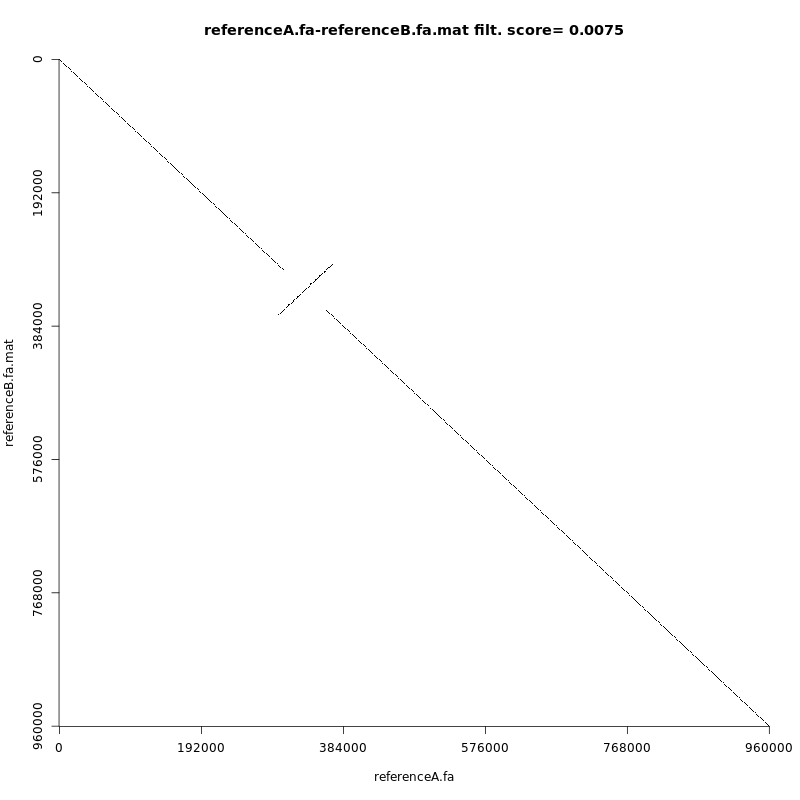
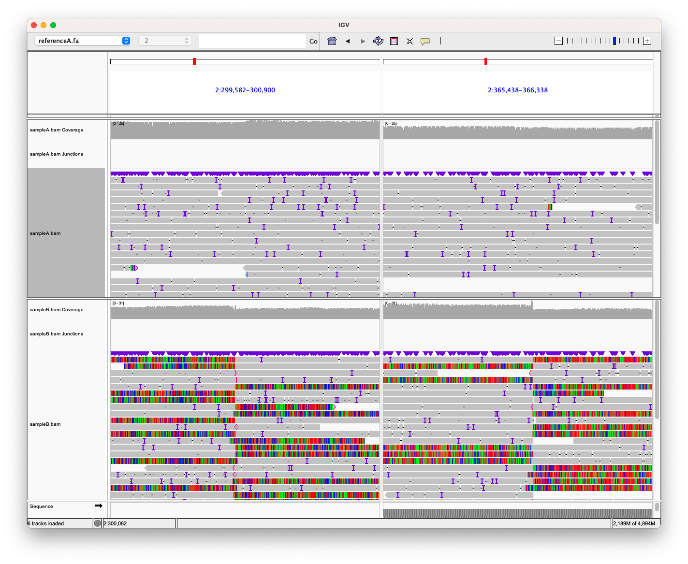

# Simulating data

1. Extracted 960kbp from chromosome two (human genome reference). To create `referenceA.fa`
``` bash
samtools faidx GRCh38-p10.fa 2 | head -n 200000 | tail -n 16000 > referenceA.fa
```

2. Created an alternative reference sequence `referenceB.fa` by manually introducing a 60kbp inversion at base ~300000.

3. Simulated reads of two samples - with and without inversion:
``` bash
pbsim --depth 20 --prefix sampleA --id-prefix sampleA --hmm_model pbsim2/data/R95.model --difference-ratio 23:31:46  ../fake_references/referenceA.fa

pbsim --depth 20 --prefix sampleB --id-prefix sampleB --hmm_model pbsim2/data/R95.model --difference-ratio 23:31:46  ../fake_references/referenceB.fa
```

# Problem 1 (Contigs as input)

Compared references with [chromeister](https://github.com/estebanpw/chromeister). 

# Problem 2 (Reads as input)

1. Aligned both samples to one of the fake refrences:

``` bash
minimap2 -ax map-ont ../../../fake_references/referenceA.fa ../fastq/sampleA_0001.fastq | samtools view -b - | samtools sort -  > sampleA.bam

minimap2 -ax map-ont ../../../fake_references/referenceA.fa ../fastq/sampleB_0001.fastq | samtools view -b - | samtools sort -  > sampleB.bam
```
The inversion in one of the samples visible in IGV.


2. Used [svim](https://github.com/eldariont/svim) to do variant calling
``` bash
svim alignment sampleA ../mapping/sampleA.bam ../../../fake_references/referenceA.fa
svim alignment sampleB ../mapping/sampleB.bam ../../../fake_references/referenceA.fa
```

Entry from the VCF file of sampleB:
``` text
2 299941  svim.INV.1  N <INV> 12  PASS  SVTYPE=INV;END=365938;SUPPORT=24;STD_SPAN=5.68;STD_POS=2.84 GT:DP:AD  1/1:24:0,24
```
